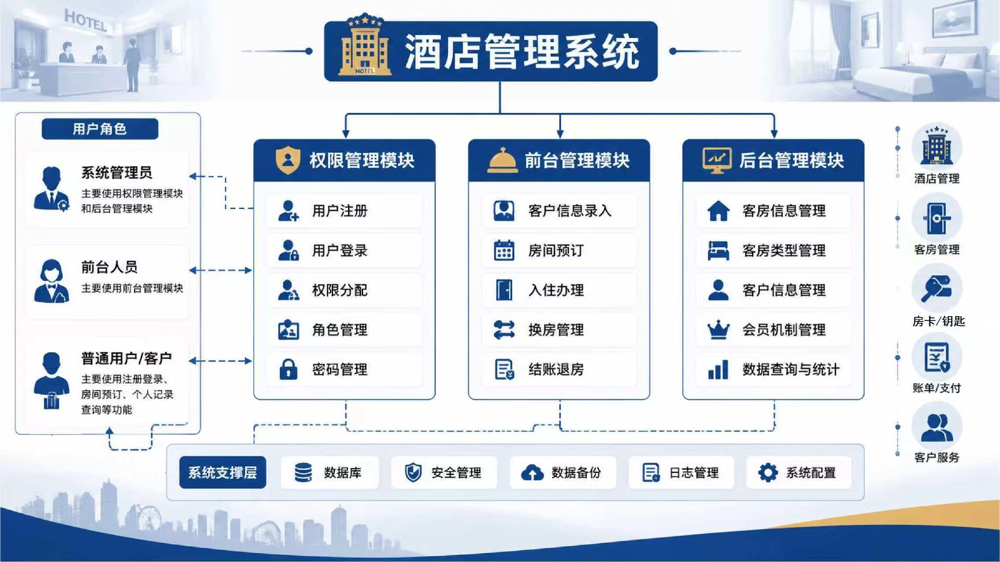
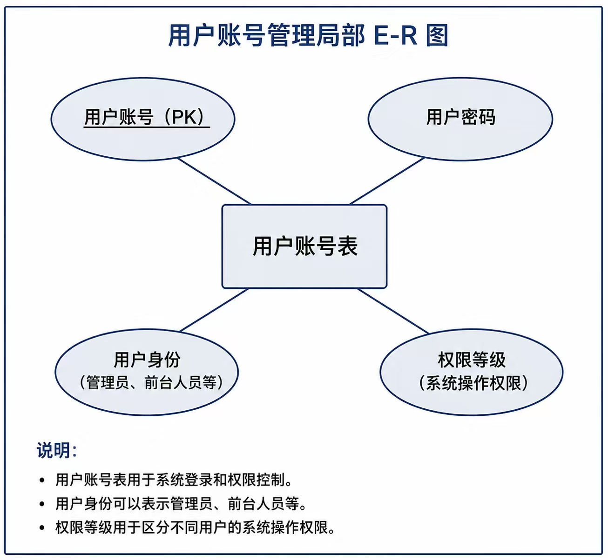
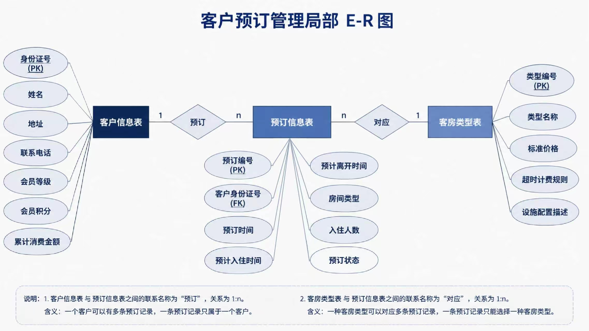

# 酒店管理系统

> 酒店管理系统 - 基于 React + Flask 的全栈 Web 应用

## 项目概述

本系统面向中小型酒店，提供权限管理、前台管理、后台管理三大核心模块，实现酒店业务管理的计算机化和规范化。系统支持三类用户角色：**系统管理员**、**前台人员**和**普通用户/客户**，不同角色登录后根据其权限进入对应的功能页面，防止越权操作。

## 系统架构图



系统采用前后端分离架构：
- **前端**：React 19 + Vite + React Router + Axios
- **后端**：Flask + PyMySQL + JWT 认证
- **数据库**：MySQL 8.0

## 课题信息

- **课题名称**：酒店管理系统
- **课题组成员**：马奕颖、屠韵如、苏佳瑶
- **完成时间**：2026年

## 人员分工

| 人员 | 负责模块 | 主要功能 | 涉及后端接口 | 涉及前端页面 |
|------|----------|----------|-------------|-------------|
| **A（屠韵如）** | **权限管理模块** | 用户/管理员注册、登录、权限修改（仅管理员） | 注册、登录、获取用户信息、修改权限 | 登录注册页、用户列表/权限管理页 |
| B（马奕颖） | 前台管理模块 | 客户信息录入、预订、入住、换房、结账 | 客户 CRUD、预订、入住、换房、结账（计算费用、生成账单） | 客户信息页、预订页、入住办理页、换房页、结账页 |
| C（苏佳瑶） | 后台管理模块 | 客房信息管理（增删改查房间类型+房间）、客户信息查询/会员机制 | 房间类型 CRUD、房间 CRUD、房间状态修改、客户查询、会员等级/积分接口 | 客房管理页、房间状态管理页、客户查询页、会员管理页 |

---

## A部分：权限管理模块（我的工作）

我负责的是**权限管理模块**，这是保证系统安全运行的基础模块。面向系统管理员、前台人员和普通用户，不同用户登录系统后，根据其角色权限进入对应的功能页面，防止越权操作。

### 核心功能

#### 1. 用户注册（Register）
- 填写用户名、密码、联系电话进行账号注册
- 注册成功后自动分配 `USER`（普通用户）角色
- 后端对用户名做唯一性校验

#### 2. 用户登录（Login）
- 输入用户名和密码进行身份认证
- 后端使用 **JWT（JSON Web Token）** 进行身份验证
- 登录成功后 Token 存入 `localStorage`，有效期 24 小时
- 登录页面采用蓝白配色 + 玻璃拟态设计，视觉效果优雅

#### 3. 权限控制与路由守卫
- 实现多种路由守卫组件：
  - `LoginRoute`：未登录用户拦截到登录页
  - `AdminRoute`：仅管理员可访问后台管理
  - `ManagerRoute` / `StaffRoute`：按角色控制页面访问权限
- 无权限访问时展示 `403` 友好提示页面（`NoPermission.jsx`）

#### 4. 用户列表与权限管理（UserManage）
- **用户列表展示**：显示用户名、手机号、角色、状态，支持角色标签彩色区分
- **角色管理**：支持 5 种角色切换（管理员/前台经理/前台员工/入住办理/普通用户），每种角色有专属标签颜色
- **账号状态管理**：管理员可一键启用/禁用账号
- **新增用户**：弹窗表单，支持设置用户名、密码、手机号、角色、状态
- **编辑用户**：修改用户信息，密码可选修改
- **删除用户**：逻辑删除，保护数据安全

### 涉及的后端 API 接口

| 接口 | 方法 | 功能 |
|------|------|------|
| `/api/auth/register` | POST | 用户注册 |
| `/api/auth/login` | POST | 用户登录（返回 JWT Token） |
| `/api/users` | GET | 获取用户列表 |
| `/api/users` | POST | 新增用户 |
| `/api/users/{id}` | PUT | 编辑用户信息 |
| `/api/users/{id}` | DELETE | 删除用户 |
| `/api/users/{id}/role` | PUT | 修改用户角色 |
| `/api/users/{id}/status` | PUT | 修改用户状态 |

### 角色定义与权限

| 角色代码 | 中文名称 | 标签颜色 | 权限说明 |
|----------|----------|----------|----------|
| ADMIN | 管理员 | 红色 | 可访问所有页面，管理用户权限 |
| MANAGER | 前台经理 | 蓝色 | 管理客房、查看客户信息 |
| STAFF | 前台员工 | 灰色 | 前台日常操作 |
| CHECKIN | 入住办理 | 青色 | 办理入住、换房、结账 |
| USER | 普通用户 | 默认色 | 查看个人信息、预订房间 |

### 界面截图

#### 登录页面


登录页面采用左右分栏设计：
- **左侧**：深蓝色渐变背景，展示"欢迎进入酒店管理系统"标题和三大特色功能卡片（舒适入住体验、安全权限控制、精致视觉风格）
- **右侧**：白色卡片区域，包含品牌标识"云栖酒店"、账号登录表单（用户名、密码）、登录按钮和注册入口

#### 注册页面


注册页面与登录页面保持一致的视觉风格：
- 左侧展示"创建账户"主题和系统特色介绍
- 右侧表单包含用户名、密码、手机号输入框和注册按钮
- 注册成功自动分配 `USER` 角色

#### 无权限提示页面


当非管理员用户尝试访问管理员专属页面时，系统友好提示：
- 展示 403 错误码和锁图标
- 提示"访问被拒绝，请联系管理员获取相应权限"
- 提供"返回首页"按钮引导用户回到安全页面

---

## E-R 图设计

### 用户账号管理局部 E-R 图



**说明**：
- 用户账号表用于系统登录和权限控制
- 用户账号（PK）唯一标识每个用户
- 用户身份可以表示管理员、前台人员等
- 权限等级用于区分不同用户的系统操作权限

### 客户预订管理局部 E-R 图



**说明**：
1. 客户信息表与预订信息表之间的联系名称为"预订"，关系为 1:n。含义：一个客户可以有多条预订记录，一条预订记录只属于一个客户。
2. 客房类型表与预订信息表之间的联系名称为"对应"，关系为 1:n。含义：一种客房类型可以对应多条预订记录，一条预订记录只能选择一种客房类型。

### 其他模块 E-R 图

本系统还包含以下 E-R 设计：
- **客房管理模块 E-R 图**：客房类型与客房信息的一对多关系
- **入住管理模块 E-R 图**：客户与客房的多对多关系（通过入住信息表实现）
- **结算管理模块 E-R 图**：入住信息与结算信息的一对一关系

---

## 技术栈

### 前端
- React 19
- Vite（构建工具）
- React Router DOM（路由管理）
- Axios（HTTP 请求）
- React Icons（图标库）

### 后端
- Python 3.13+
- Flask（Web 框架）
- Flask-CORS（跨域支持）
- PyMySQL（MySQL 驱动）
- python-dotenv（环境变量管理）
- PyJWT（JWT 认证）

### 数据库
- MySQL 8.0
- 数据库名：`hotel_system`

---

## 项目结构

```
hotel-management-system/
├── hotel-frontend/          # React 前端项目
│   ├── src/
│   │   ├── api/
│   │   │   └── request.js       # API 请求封装
│   │   ├── components/
│   │   │   ├── AdminRoute.jsx   # 管理员路由守卫
│   │   │   ├── LoginRoute.jsx   # 登录路由守卫
│   │   │   ├── ManagerRoute.jsx # 经理路由守卫
│   │   │   └── StaffRoute.jsx   # 员工路由守卫
│   │   ├── pages/
│   │   │   ├── Login.jsx        # 登录页（A负责）
│   │   │   ├── Register.jsx     # 注册页（A负责）
│   │   │   ├── UserManage.jsx   # 用户管理页（A负责）
│   │   │   ├── Admin.jsx        # 管理员控制台（A负责）
│   │   │   ├── NoPermission.jsx # 无权限提示页（A负责）
│   │   │   ├── Home.jsx         # 首页
│   │   │   ├── CustomerInfo.jsx # 客户信息页（B负责）
│   │   │   ├── Reservation.jsx  # 预订页（B负责）
│   │   │   ├── Checkin.jsx      # 入住办理页（B负责）
│   │   │   ├── RoomChange.jsx   # 换房页（B负责）
│   │   │   ├── Settlement.jsx   # 结账页（B负责）
│   │   │   ├── RoomManage.jsx   # 客房管理页（C负责）
│   │   │   └── RoomTypeManage.jsx # 客房类型管理页（C负责）
│   │   ├── router/
│   │   │   └── index.jsx        # 路由配置
│   │   ├── App.jsx
│   │   ├── App.css              # 全局样式（含角色标签样式）
│   │   └── main.jsx
│   ├── package.json
│   └── index.html
│
├── hotel-backend/           # Flask 后端项目
│   ├── app.py               # 后端主程序
│   ├── init.sql             # 数据库初始化脚本
│   └── .env                 # 环境变量配置
│
├── E-R/                     # E-R 图文件夹
├── 界面/                    # 界面截图文件夹
├── 概念逻辑结构设计.txt      # 数据库设计文档
├── 系统需求分析.txt          # 需求分析文档
└── README.md
```

---

## 运行方式

### 1. 初始化数据库

```bash
# 进入后端目录
cd hotel-backend

# 使用 MySQL 初始化数据库
mysql -u root -p < init.sql
```

### 2. 启动后端服务

```bash
cd hotel-backend
pip install flask flask-cors pymysql python-dotenv
python app.py
```

后端服务默认运行在 `http://127.0.0.1:5000`

### 3. 启动前端服务

```bash
cd hotel-frontend
npm install
npm run dev
```

前端服务默认运行在 `http://localhost:5173`

### 4. 访问系统

打开浏览器访问 `http://localhost:5173`，默认进入登录页面。

---

## 数据库表结构

### 用户表（user）

| 字段 | 类型 | 说明 |
|------|------|------|
| id | INT AUTO_INCREMENT | 主键 |
| username | VARCHAR(50) | 用户名（唯一） |
| password | VARCHAR(100) | 密码 |
| phone | VARCHAR(20) | 联系电话 |
| role | ENUM | 角色：ADMIN/MANAGER/STAFF/CHECKIN/USER |
| status | TINYINT | 状态：1启用/0禁用 |
| deleted | TINYINT | 逻辑删除标记 |
| created_at | TIMESTAMP | 创建时间 |
| updated_at | TIMESTAMP | 更新时间 |

---

## 总结

本项目为三人协作完成的酒店管理系统课程设计，我（A/屠韵如）负责**权限管理模块**的完整开发，包括：

1. **前端页面**：登录页、注册页、管理员控制台、用户管理页、无权限提示页
2. **后端接口**：用户注册、登录认证（JWT）、用户信息 CRUD、角色管理、状态管理
3. **路由守卫**：多层级权限控制，确保不同角色只能访问其授权页面
4. **界面设计**：蓝白配色 + 玻璃拟态风格，视觉效果优雅统一
5. **数据库设计**：用户账号管理 E-R 图及用户表结构设计

系统实现了完整的权限控制体系，为酒店业务的安全运行提供了基础保障。
